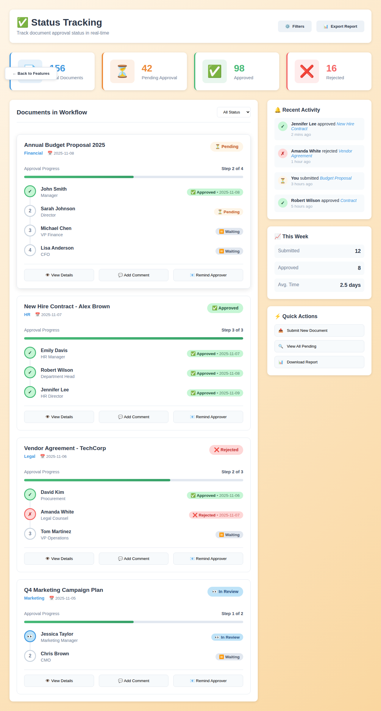
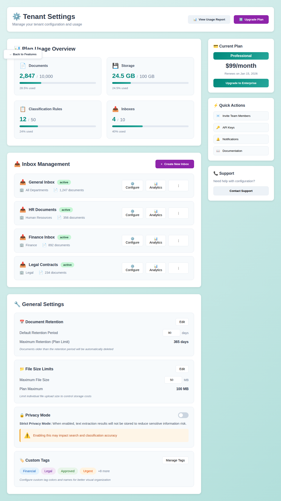
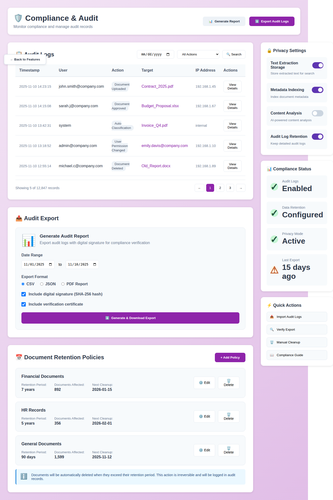
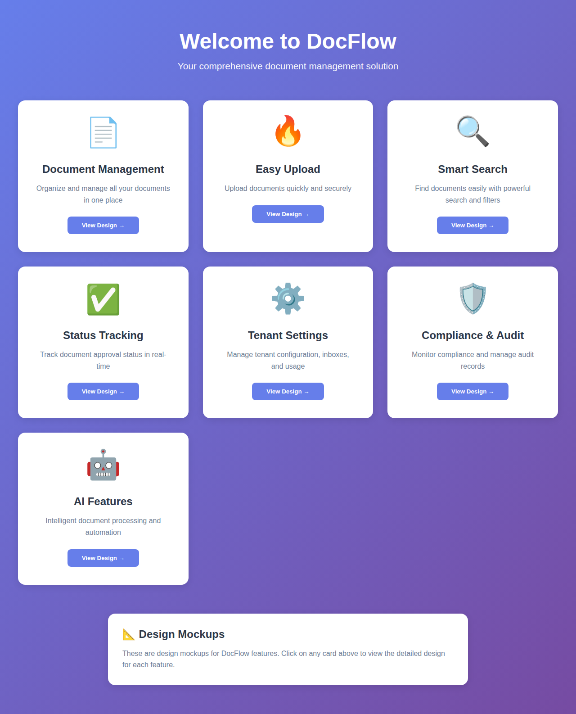

# Design Mockups for DocFlow Feature Cards

This directory contains screenshots of the design mockups for all DocFlow features:

## Core Features (Original 4)

### 1. Document Management (📄)
Organize and manage all your documents in one place with:
- Category-based organization (Financial, HR, Legal, Marketing, Technical)
- Folder structure for better organization
- Grid/List view options
- Document cards with metadata, tags, and status
- Quick actions (View, Download, Share)

## 2. Easy Upload (🔥)
Upload documents quickly and securely with:
- Drag & drop interface
- Multiple upload methods (folder, URL, cloud import, email)
- Upload settings (auto-classify, metadata extraction, OCR, virus scan)
- Upload statistics dashboard
- Recent uploads tracking
- Quick tips for better user experience

## 3. Smart Search (🔍)
Find documents easily with powerful search and filters:
- Advanced search box with suggestions
- Smart features (AI-powered matching, full-text search, tag search, instant results)
- Multiple filters (document type, date range, file type)
- Search results with relevance scoring
- Saved searches functionality
- Preview and quick actions on results

### 4. Status Tracking (✅)
Track document approval status in real-time with:
- Statistics dashboard (Total, Pending, Approved, Rejected)
- Document workflow visualization
- Approval timeline with step-by-step progress
- Approver information and status
- Recent activity feed
- Weekly statistics
- Quick actions panel



## Administrative Features (New)

### 5. Tenant Settings (⚙️)
Manage tenant configuration, inboxes, and usage with:
- Plan usage overview (documents, storage, rules, inboxes)
- Inbox management by department/workflow
- Document retention period settings
- File size limits configuration
- Privacy mode controls (strict privacy settings)
- Custom tag color and name management
- Current plan and billing information
- Quick access to API keys and notifications



### 6. Compliance & Audit (🛡️)
Monitor compliance and manage audit records with:
- Detailed audit log table with filtering
- Audit export functionality (CSV/JSON/PDF)
- Digital signature and verification certificate support
- Document retention policies management
- Automatic cleanup scheduling
- Privacy settings configuration
- Compliance status dashboard
- Quick verification and import tools



### 7. AI Features (🤖)
Intelligent document processing and automation with:
- AI system status monitoring
- AI-powered document processing
- Suggested tags with confidence scores
- One-click tag application
- AI-generated document summaries
- AI feature configuration toggles
- Emergency AI shutdown controls
- AI usage statistics and accuracy metrics
- Tips for improving AI accuracy


## Updated Homepage

The homepage now includes all 7 feature cards for comprehensive access:



## Viewing the Designs

To view these designs interactively:

1. Start the development server:
   ```bash
   npm install --legacy-peer-deps
   npm run dev
   ```

2. Open your browser and navigate to:
   ```
   http://localhost:5173/designs.html
   ```

3. Click on any feature card to view the detailed design mockup for that feature.

## Design Features

- Consistent color schemes matching each feature's theme
- Intuitive user interface with clear visual hierarchy
- Responsive layout
- Interactive elements (buttons, cards, filters)
- Professional and modern design aesthetic
